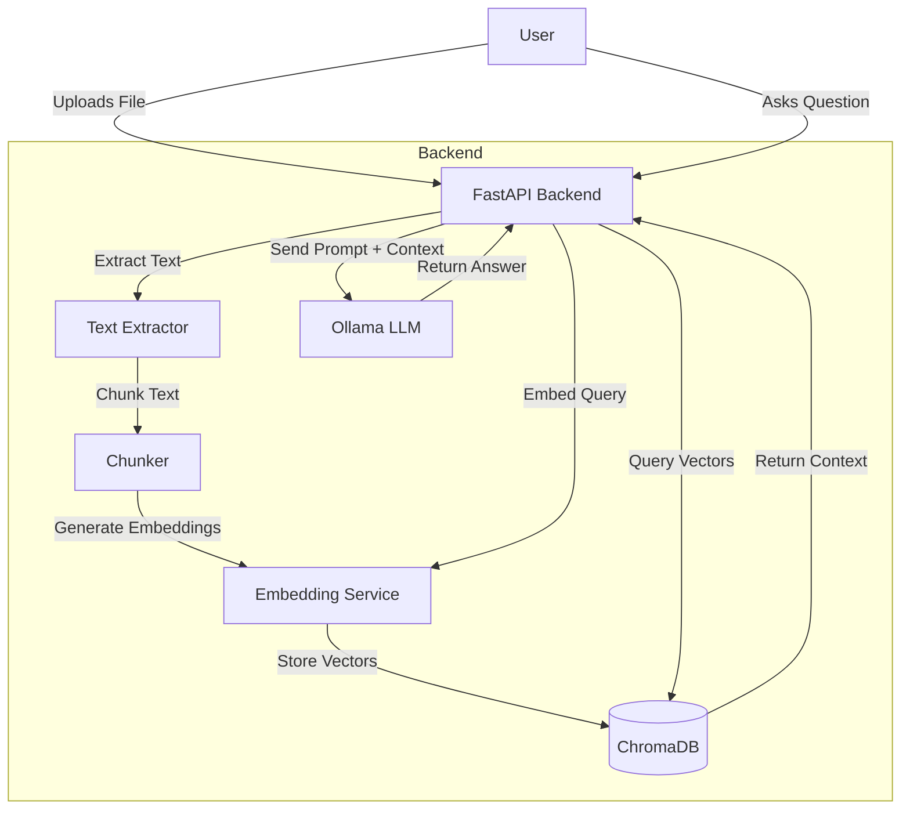

# System Architecture

This document outlines the architecture of the Document RAG Service.

## Overview

The system is a Retrieval-Augmented Generation (RAG) application that allows users to upload documents (PDF/TXT) and ask questions about them. The backend ingests the documents, creates vector embeddings, and uses an LLM to generate answers based on retrieved context.

## Technology Stack

- **Frontend**: Next.js, React, Tailwind CSS, Framer Motion
- **Backend**: FastAPI (Python)
- **Vector Database**: ChromaDB
- **LLM**: Ollama (running locally or via API)
- **Embeddings**: Sentence Transformers (`all-MiniLM-L6-v2`)
- **PDF Processing**: `pdfminer.six`
- **Containerization**: Docker & Docker Compose

## Data Flow

### 1. Ingestion Pipeline
When a file is uploaded:
1. **Text Extraction**: Text is extracted from the PDF or TXT file.
2. **Chunking**: The text is split into smaller, overlapping chunks.
3. **Embedding**: Each chunk is converted into a vector embedding using `SentenceTransformer`.
4. **Storage**: Vectors and metadata are stored in ChromaDB.

### 2. Retrieval & Generation (RAG)
When a user asks a question:
1. **Query Embedding**: The user's query is converted into a vector.
2. **Vector Search**: ChromaDB finds the top-k most similar chunks to the query.
3. **Context Assembly**: The retrieved text chunks are combined into a prompt.
4. **Generation**: The LLM generates an answer using the prompt and context.

## Architecture Diagram

